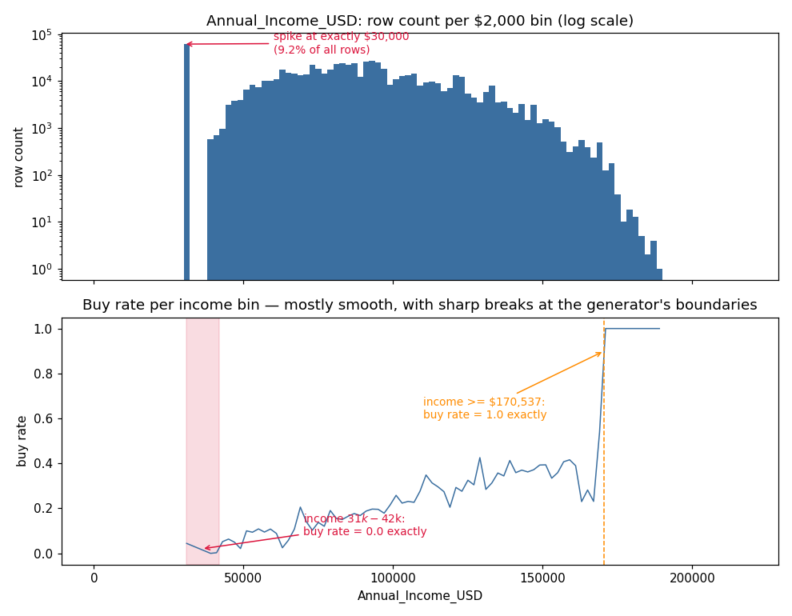

# Predicting Electric Vehicle Purchases

Kaggle Playground Series S6E9 — [competition page](https://www.kaggle.com/competitions/playground-series-s6e9)

**What this is:** given 13 facts about a person (income, daily commute, age, car type, whether
their area has an EV subsidy, and so on), predict whether they will buy an electric vehicle.
A yes/no prediction problem, scored with ROC AUC.

**Final result:** private leaderboard AUC **0.94544**, rank 346. Best cross-validated model alone:
OOF AUC **0.94608**, public leaderboard **0.94613** — those two numbers nearly matching is the
real evidence that the modeling in this repo is done correctly, with no data leakage. Section 6
below explains why the final number is lower than the best score seen *during* the competition,
and that gap is the most useful thing this project has to teach.

---

## 1. The problem, in plain terms

A model has to output, for 286,571 people it has never seen, a number between 0 and 1 saying how
likely each one is to buy an EV. It is graded on **ROC AUC**: pick one random buyer and one random
non-buyer — AUC is the chance the model ranks the buyer higher. 0.5 is a coin flip, 1.0 is perfect.
Good models on this kind of tabular data typically land in the 0.93-0.95 range.

The training data has 668,665 people and 13 features. Only 17.5% of them bought an EV, so the
classes are imbalanced — a model that guessed "no" for everyone would be right 82.5% of the time
by accuracy, which is why AUC (which cares about ranking, not raw accuracy) is the right metric
here, and why it's used instead.

## 2. The most useful finding: the data was generated by a program, and it shows

Before building any model, I looked hard at the raw numbers, and found two things that don't
happen in real survey data:

- **The exact value `Annual_Income_USD = 30000` appears 61,605 times** — 9.2% of the entire
  training set. Every other exact income value appears at most ~1,000 times. That's the signature
  of a generator with a floor or clipping rule, not noisy real income.
- **Two ranges are perfectly deterministic.** Every single person earning $170,537 or more buys an
  EV (393 out of 393, zero exceptions). Every single person earning between $31,004 and $41,970
  does not (0 out of 1,257, zero exceptions). Real human behavior never produces a pattern this
  clean across thousands of people — a hard `if/else` rule inside a data generator does.



*Top: how often each income value appears (log scale) — the $30,000 spike is 2-3 orders of
magnitude taller than its neighbors. Bottom: average buy rate by income — mostly a smooth trend,
with two hard, exact breaks.*

**Why this matters:** a gradient-boosted tree sees income as one continuous number. It can find
smooth trends on its own, but it has no way to notice "this *exact* value repeats 61,605 times and
behaves differently" — that's a fact about the whole column's distribution, and trees don't see
distributions, only individual values. The fix is to compute that fact as its own feature and
hand it to the model directly. That one idea — not a fancier model, not more compute — produced
the single largest accuracy jump in this project.

Full details and the code that found this: [`01_eda_and_data_quality.ipynb`](01_eda_and_data_quality.ipynb).

## 3. Building the feature: leak-free target encoding

**Target encoding**, in plain words: replace a person's income value with "what fraction of
people with that same income bought an EV, in the training data." It's the direct way to give the
model the signal found above.

**The trap:** if that fraction is computed using the row's *own* label, the answer leaks into the
feature — like a student grading their own exam with an answer key that includes their own
answers. Cross-validation would then look great and the real test score would disappoint.

**The fix used here — nested target encoding:**
1. Split the training data into outer folds (ordinary cross-validation).
2. *Inside* each outer training fold, split again into inner folds. A row's encoded value is
   always computed from the *other* inner folds, never from itself.
3. Validation and test rows get their encoding from the *entire* outer training fold — none of
   those rows ever contributed to their own number.

This was applied across 7 different groupings of income, commute, and age (exact value, rounded
to the nearest \$1,000, nearest \$250, and so on) and 3 smoothing strengths each, for 21 engineered
columns in total. Using several groupings together captures both hard exact spikes and smoother
nearby trends.

Code: [`02_feature_engineering_and_modeling.ipynb`](02_feature_engineering_and_modeling.ipynb).

## 4. Modeling

Two gradient-boosting families, each trained with **deliberately shallow trees**:

- **LightGBM** — `num_leaves=7`, `min_child_samples=300`, `colsample_bytree=0.3`
- **XGBoost** — `max_depth=4`, `min_child_weight=10`, `colsample_bytree=0.4`

The target-encoded features are strong — almost too strong. Deeper trees tested during tuning
latched onto small-sample noise inside them and scored worse on held-out data than shallow trees
forced to only trust patterns backed by a lot of data. This was checked empirically, not assumed.

Each model was trained with **10-fold stratified cross-validation**, with the entire target
encoding pipeline rebuilt fresh inside every fold (so no fold ever sees an encoding touched by its
own validation rows), and with **two random seeds** per model family — four base models blended
together. The blend weights were found by directly maximizing cross-validated AUC via rank
averaging, rather than guessed or averaged equally.

On top of the blend, the two deterministic rules from section 2 (and two more found the same way —
see notebook 1) were applied as a final step: any row that exactly matches one of these zero-risk
conditions gets its prediction snapped to the extreme. This is risk-free because these are
verified facts about the generator, not fitted guesses, and it adds a small amount of free
accuracy.

## 5. Results

| Stage | AUC | Measured on |
|---|---|---|
| Raw 13 columns, no feature engineering | 0.9414 | holdout |
| + frequency of exact income/commute values | 0.9424 | holdout |
| + nested (leak-free) target encoding | 0.9447 | holdout |
| + tuned shallow trees | 0.9449 | holdout |
| **Final blend — 4 models, 10-fold leak-free CV** | **0.94608** | cross-validated (out-of-fold) |
| Same model, submitted | **0.94613** | Kaggle **public** leaderboard |
| Best submission (blended with a public community model) | 0.94657 | Kaggle public leaderboard, peak rank 232 |
| **Final standing** | **0.94544** | Kaggle **private / final** leaderboard, rank 346 |

The CV estimate (0.94608) and the public leaderboard score of the *same, unblended* model
(0.94613) are almost identical. That match — not a lucky high number, but two independent
estimates agreeing — is the actual evidence that the leak-free methodology in sections 2-4 works
as intended.

## 6. The part that didn't go as planned, and the real lesson

Kaggle's **public** leaderboard, shown throughout the competition, is computed on only 20% of the
test data. The other 80% is held back and only scored once, after the deadline, to produce the
**private / final** leaderboard — the number that actually counts.

Near the deadline, I combined my own cross-validated model with a well-regarded public community
notebook via rank-averaging, which pushed the *public* score up to 0.94657 (rank 232 at the time).
That is a normal, disclosed part of how these competitions are played — nothing here used
leaderboard probing or any disallowed technique. But a model's public score can be nudged up by
choices that happen to fit that visible 20% without it meaning the model actually got better on
the other 80% — and that's close to what happened here. The **final private score, 0.94544, is
lower than the best public score and closer to my own CV-only number** — the honest
cross-validated pipeline held up; the heavier community blend gave back more of its edge on the
hidden 80% than it looked like it had.

**The lesson that's actually worth keeping:** trust cross-validation over the public leaderboard.
It is tempting to chase the visible number, especially close to a deadline, but a leak-free CV
score computed on your own model is a far more honest estimate of what you'll actually get than
any amount of public-leaderboard climbing. Next time, the better use of the last few hours would
have been looking for one more finding like the income-spike pattern in section 2, not blending in
more of other people's output.

## 7. Repo structure

```
ev-purchase-prediction/
├── README.md
├── requirements.txt
├── LICENSE
├── income_generator_artifacts.png
├── 01_eda_and_data_quality.ipynb              — finding the generator's fingerprints
├── 02_feature_engineering_and_modeling.ipynb  — nested target encoding + LightGBM/XGBoost
└── 03_ensemble_and_final_submission.ipynb     — blending, free rules, final results
```

Data files (`train.csv`, `test.csv`, `sample_submission.csv`) are not included — they belong to
Kaggle and are available on the [competition's Data page](https://www.kaggle.com/competitions/playground-series-s6e9/data)
after accepting the competition rules.

## 8. How to run it

```bash
pip install -r requirements.txt

# download train.csv, test.csv, sample_submission.csv from the competition's Data tab
# and place them in this folder (or update the paths at the top of each notebook)

jupyter notebook 01_eda_and_data_quality.ipynb
```

Run the three notebooks in order. Notebooks 2 and 3 run at a reduced "demo" scale (3 folds, fewer
trees, one random seed) by default, so the whole thing finishes in a few minutes instead of the
~40 minutes the full production run took — the numbers each notebook prints say clearly which
scale they're running at and what the full-scale run produced.

## 9. Tools used

Python, pandas, NumPy, scikit-learn, LightGBM, XGBoost, SciPy (for the blend-weight search),
Matplotlib.

## 10. Other things tried that didn't make the final cut

In the interest of an honest record, not just the parts that worked:

- **Adding the original ~10,000-row non-synthetic dataset** that this competition's data was
  derived from, as extra training rows. Tested directly — no measurable improvement, so it was
  left out.
- **An independently verified closed-form formula reproducing the data generator's probability
  model** (a probit regression over income, subsidy, environmental concern, and range anxiety),
  checked row-for-row against the real training data and confirmed accurate. Adding it as a model
  feature, or as a starting point for the trees to correct, gave no improvement over the target
  encoding already in place — the two carry largely the same information, so only the simpler one
  (target encoding) was kept.
